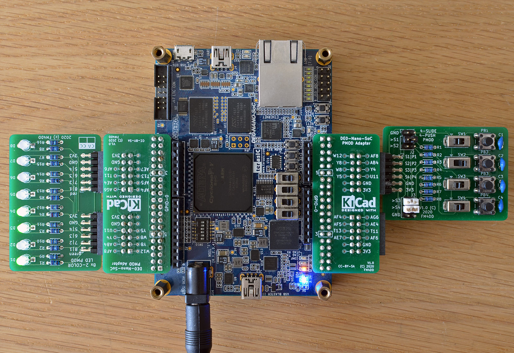

## 8LED2 PMOD

### Description


This PMOD provides 8x dual-color LED display output to FPGA designs via two double row PMODs.
It is possible to install either type of dual-color LEDs: “common cathode” or “common anode”. The default is “common cathode”, which allows for working with normal logic. WIth normal logic, setting the output “HIGH” lights up the LED. If "common anode" LEDs are installed, JP1 must separate GND, and close the connection to + 3.3V. Common anode uses inverted logic, The LEDs light up when the output is set "LOW".
[fpga.fm4dd.com](http://fpga.fm4dd.com/)

### Schematic
[](images/8led2-schema.png)

### PCB Gerber

[8LED2 PMOD Gerber V1.0](20200206-8led2-gerber-v10.zip)

### Pin Assignments

#### IceBreaker v1.0

 J1# |  Label | Description   | PMOD1A
-----|--------|---------------|-------
1    |  D1    | LED D1 green  | 4
2    |  D2    | LED D2 green  | 2
3    |  D3    | LED D3 green  | 47
4    |  D4    | LED D4 green  | 45
7    |  D5    | LED D5 green  | 3
8    |  D6    | LED D6 green  | 48
9    |  D7    | LED D7 green  | 46
10   |  D8    | LED D8 green  | 44

 J2# |  Label | Description   | PMOD1B
-----|--------|---------------|-------
1    |  D1    | LED D1 red    | 43
2    |  D2    | LED D2 red    | 38
3    |  D3    | LED D3 red    | 34
4    |  D4    | LED D4 red    | 31
7    |  D5    | LED D5 red    | 42
8    |  D6    | LED D6 red    | 36
9    |  D7    | LED D7 red    | 32
10   |  D8    | LED D8 red    | 28


#### DE0-Nano-SoC

The connection to Intels DE0-Nano-SoC is made through the pmod2nano adapter.


 J1# |  Label | Description   | GPIO0A | GPIO1A
-----|--------|---------------|--------|--------
1    |  D1    | LED D1 green  | PIN_AF8|PIN_AH27
2    |  D2    | LED D2 green  | PIN_AB4|PIN_AH24
3    |  D3    | LED D3 green  | PIN_Y4 |PIN_AE22
4    |  D4    | LED D4 green  | PIN_U11|PIN_AG20
7    |  D5    | LED D5 green  | PIN_W12|PIN_AA15
8    |  D6    | LED D6 green  | PIN_Y8 |PIN_AG26
9    |  D7    | LED D7 green  | PIN_W8 |PIN_AF23
10   |  D8    | LED D8 green  | PIN_Y5 |PIN_AF21

 J2# |  Label | Description   | GPIO0B | GPIO1B
-----|--------|---------------|--------|--------
1    |  D1    | LED D1 red    | PIN_AG6| PIN_AG23
2    |  D2    | LED D2 red    | PIN_AE4| PIN_AF18
3    |  D3    | LED D3 red    | PIN_T11| PIN_AE20
4    |  D4    | LED D4 red    | PIN_AF6| PIN_AD20
7    |  D5    | LED D5 red    | PIN_AF4| PIN_AH23
8    |  D6    | LED D6 red    | PIN_AF5| PIN_AE19
9    |  D7    | LED D7 red    | PIN_T13| PIN_AD19
10   |  D8    | LED D8 red    | PIN_AE7| PIN_AE24

### Example Code

#### Verilog

Verilog test program pmod8led2_1.v (top-level):
```
// -------------------------------------------------------
// This program tests HW pin assignment, and lights up D1
//--------------------------------------------------------
module pmod8led2_1 (
  output [0:7] pmodledr
);

  reg led;
  assign pmodledr[7] = led;

  always
  begin
    led = 1'b1;  // light up D1
  end
endmodule
```

Verilog test program pmod8led2_2.v (top-level):
```
// -------------------------------------------------------
// This program is a binary counter, displayed on the pmod
// LED D2-8 green color. The 1Hz clock pulse is on D1 red.
// 12MHz clock: set breakpoint at 23'd5999999 (icebreaker)
// 50MHz clock: set breakpoint at 25'd24999999 (de0-nano)
//--------------------------------------------------------
module pmod8led2_2 (
  input clk,
  output reg [0:7] pmodledg,
  output reg [0:7] pmodledr
);

  reg clk_1hz = 1'b0;
  reg [22:0] count = 23'd0;
  reg [6:0] lednum = 7'd0;
  assign [1:7] pmodledg = lednum;
  assign [1:7] pmodledr = 7'b0000000;
  assign pmodledr[0] = clk_1hz;

  always @(posedge clk)
  begin
    count   <= count + 1;
    if(count == 23'd5999999)
    begin
      count   <= 0;
      clk_1hz <= ~clk_1hz;
      lednum  <= lednum + 1;
    end
  end
endmodule
```

#### VHDL

The Verilog example pmod8led2_2.v converted to VHDL as pmod8led2_3.vhd:

```
library ieee;
use ieee.std_logic_1164.all;
use ieee.numeric_std.all;

entity pmod_8led2_3 is
port ( clk: in STD_LOGIC;
  pmodledg: out STD_LOGIC_VECTOR(0 to 7) := "00000000";
  pmodledr: out STD_LOGIC_VECTOR(0 to 7) := "00000000"
);
end pmod_8led2_3;

architecture arch of pmod_8led2_3 is
  signal clk_1hz: STD_LOGIC := '0';
  signal  lednum: STD_LOGIC_VECTOR(6 downto 0) := "0000000";

  begin
    counter_p: process( clk, clk_1hz, lednum )
    variable count: INTEGER := 0;
    begin
      if( rising_edge(clk) ) then
        count := count + 1;
        if( count = 24999999 ) then
               count := 0;
               clk_1hz <= NOT clk_1hz;
                 lednum  <= std_logic_vector( unsigned(lednum) + 1);
        end if;
           end if;

    pmodledr(0) <= clk_1hz;
    pmodledg(1) <= lednum(6);
    pmodledg(2) <= lednum(5);
    pmodledg(3) <= lednum(4);
    pmodledg(4) <= lednum(3);
    pmodledg(5) <= lednum(2);
    pmodledg(6) <= lednum(1);
    pmodledg(7) <= lednum(0);
  end process counter_p;
end arch;
```


8LED2 PMOD on a DE0-Nano-SoC board
